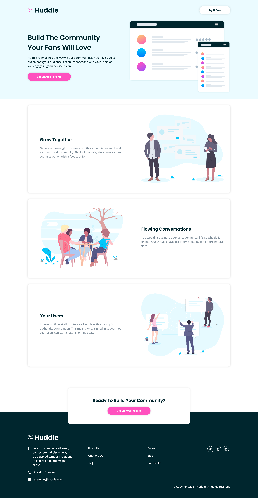

<!-- omit in toc -->
# Project: Huddle Landing Page
- [About the Project](#about-the-project)
- [Screenshot](#screenshot)
- [Technologies and Standards Used](#technologies-and-standards-used)
- [Components Hierarchy](#components-hierarchy)
- [Live Demo](#live-demo)

## About the Project
This project is a solution to the [Huddle landing page with alternating feature blocks challenge](https://www.frontendmentor.io/challenges/huddle-landing-page-with-alternating-feature-blocks-5ca5f5981e82137ec91a5100) taken from Frontend Mentor and made in *ReactJS* using *React Hooks* and *Styled Components*.

## Screenshot

## Technologies and Standards Used
**The technologies that have been used are:**
1. HTML (Hyper Text Markup Language)
2. CSS (Cascading Style Sheets)
3. ReactJS
4. React Styled Components

## Components Hierarchy
You can read about the structure and usage of the different components - [here](https://5hraddha.github.io/huddle-landing-page/../../../styleguide/index.html)  

## Live Demo
Check the live page [here](https://5hraddha.github.io/huddle-landing-page/)

